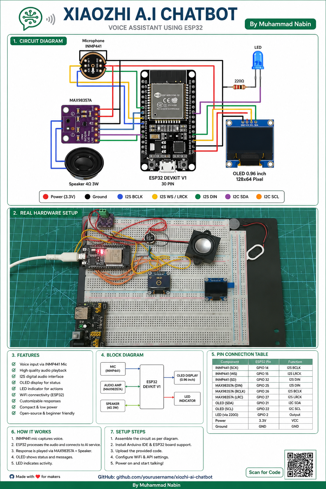

<div align="center">

# 📘 ESP32-WROOM — XiaoZhi AI Chatbot

[](#-flashing-the-firmware)
[](#)
[](#-oled-display-i2c--ssd1306-128×64)
[](#-credits)

Firmware and complete wiring guide for the **ESP32 Dev Board (WROOM-32)**

[🏠 Main README](../README.md) · [📗 Switch to S3 Guide](../esp32-s3/README.md)

</div>

---

## 📷 Hardware Photo

<!-- PHOTO PLACEHOLDER — add your real photo here when ready -->
<!-- 📸 Real-time hardware photos will be updated as the build progresses -->

<div align="center">
  
  <br/>
  <sub>📸 <em>Hardware photo — will be updated with real build photos</em></sub>
</div>

---

## 🛒 Parts List

| # | Component | Specification | Qty |
|:---:|---|---|:---:|
| 1 | 🟥 ESP32 Dev Board | WROOM-32 (30-pin or 38-pin) | 1 |
| 2 | 🟦 OLED Display | 0.96" I2C 128×64 SSD1306 | 1 |
| 3 | 🟪 Microphone | INMP441 I2S MEMS Module | 1 |
| 4 | 🟫 Amplifier | MAX98357A I2S Class D | 1 |
| 5 | ⬛ Speaker | 2 Watt 4Ω | 1 |
| 6 | 🔴 LED | 5mm Red (or any color) | 1 |
| 7 | 🟤 Resistor | 220Ω | 1 |
| 8 | 🔌 Jumper Wires | Male-to-Female, Male-to-Male | — |

---

## 🔌 Wiring / Pin Connections

> 💡 **Tip:** Match the wire colors in the circuit diagram to these tables for easy reference.

---

### 🟦 OLED Display — I2C (SSD1306 128×64)

```
╔══════════════════════════════════════════╗
║      OLED 128×64  →  ESP32-WROOM         ║
╠══════════════════╦═══════════════════════╣
║  OLED Pin        ║  ESP32 Pin            ║
╠══════════════════╬═══════════════════════╣
║  GND             ║  GND                  ║
║  VCC             ║  3.3V                 ║
║  SCL             ║  GPIO 22  (D22)       ║
║  SDA             ║  GPIO 21  (D21)       ║
╚══════════════════╩═══════════════════════╝
```

---

### 🟪 INMP441 — I2S Microphone

```
╔══════════════════════════════════════════╗
║     INMP441 MIC  →  ESP32-WROOM          ║
╠══════════════════╦═══════════════════════╣
║  MIC Pin         ║  ESP32 Pin            ║
╠══════════════════╬═══════════════════════╣
║  GND             ║  GND                  ║
║  VDD             ║  3.3V                 ║
║  SCK             ║  GPIO 14              ║
║  WS              ║  GPIO 15              ║
║  SD              ║  GPIO 32              ║
║  L/R             ║  GND  (Mono Left)     ║
╚══════════════════╩═══════════════════════╝
```

> ⚠️ **Important:** L/R pin **must** be tied to GND for mono-left operation. Leaving it floating causes noise or silence.

---

### 🟫 MAX98357A — I2S Amplifier

```
╔══════════════════════════════════════════╗
║    MAX98357A AMP  →  ESP32-WROOM         ║
╠══════════════════╦═══════════════════════╣
║  AMP Pin         ║  ESP32 Pin            ║
╠══════════════════╬═══════════════════════╣
║  GND             ║  GND                  ║
║  VIN             ║  5V  (VIN)            ║
║  BCLK            ║  GPIO 27              ║
║  LRC             ║  GPIO 26              ║
║  DIN             ║  GPIO 25              ║
║  GAIN            ║  (leave floating)     ║
╚══════════════════╩═══════════════════════╝
```

> 🔈 Connect your **2W 4Ω Speaker** to the **OUT+** and **OUT−** terminals on the MAX98357A board.

---

### 🔴 Status LED

```
╔══════════════════════════════════════════╗
║       LED + Resistor  →  ESP32-WROOM     ║
╠══════════════════╦═══════════════════════╣
║  Connection      ║  Detail               ║
╠══════════════════╬═══════════════════════╣
║  GPIO 2          ║  → 220Ω Resistor      ║
║  Resistor other  ║  → LED Anode  (+)     ║
║  LED Cathode (−) ║  → GND                ║
╚══════════════════╩═══════════════════════╝
```

---

## 📐 Circuit Diagram

<!-- CIRCUIT DIAGRAM PLACEHOLDER — add your diagram here when ready -->
<!-- 📸 Real-time circuit diagram will be updated -->

<div align="center">
  
  <br/>
  <sub>📐 <em>Circuit diagram by <strong>Muhammad Nabin</strong> — full-size: <a href="docs/circuit_diagram.svg">docs/circuit_diagram.svg</a></em></sub>
</div>

---

## 📥 Flashing the Firmware

### 🔧 Prerequisites

- ✅ Python 3.x installed
- ✅ `esptool` installed:
  ```bash
  pip install esptool
  ```
- ✅ USB Micro-B cable connected to your ESP32-WROOM board
- ✅ USB drivers installed (CP2102 or CH340 depending on your board)

> 🔍 **Find your port:**  
> - **Windows** → Device Manager → Ports (COM & LPT) → e.g. `COM3`  
> - **Linux** → `ls /dev/ttyUSB*` → e.g. `/dev/ttyUSB0`  
> - **macOS** → `ls /dev/cu.*` → e.g. `/dev/cu.SLAB_USBtoUART`

---

### 🗑️ Step 1 — Erase Flash *(recommended for first-time flash)*

```bash
esptool.py --chip esp32 --port <YOUR_PORT> erase_flash
```

---

### 💾 Step 2 — Flash the Firmware

```bash
esptool.py --chip esp32 --port <YOUR_PORT> --baud 460800 \
  write_flash -z 0x0 firmware/ESP32-OLED-128X64-v1.9.2.bin
```

**Examples by OS:**

```bash
# ── Windows ──────────────────────────────────────────────────────────
esptool.py --chip esp32 --port COM4 --baud 460800 \
  write_flash -z 0x0 firmware/ESP32-OLED-128X64-v1.9.2.bin

# ── Linux ────────────────────────────────────────────────────────────
esptool.py --chip esp32 --port /dev/ttyUSB0 --baud 460800 \
  write_flash -z 0x0 firmware/ESP32-OLED-128X64-v1.9.2.bin

# ── macOS ────────────────────────────────────────────────────────────
esptool.py --chip esp32 --port /dev/cu.SLAB_USBtoUART --baud 460800 \
  write_flash -z 0x0 firmware/ESP32-OLED-128X64-v1.9.2.bin
```

---

### ▶️ Step 3 — Reset & Boot

Press the **EN (Reset)** button on your board after flashing.  
The OLED display will light up and show the startup animation. ✅

---

## ✅ Pre-Power Checklist

```
[ ] OLED → SCL wired to GPIO 22, SDA wired to GPIO 21
[ ] OLED → VCC wired to 3.3V (NOT 5V)
[ ] INMP441 mic → L/R pin tied to GND
[ ] INMP441 mic → VDD wired to 3.3V
[ ] MAX98357A amp → VIN wired to 5V (VIN pin)
[ ] Speaker connected to OUT+ and OUT− on amp
[ ] LED → 220Ω resistor in series between GPIO 2 and anode
[ ] No short circuits on 3.3V or 5V rails
[ ] Correct firmware file selected (v1.9.2 for WROOM)
[ ] Firmware flashed successfully (no error in terminal)
```

---

## 🔧 Troubleshooting

| ❌ Problem | 🔍 Likely Cause | ✅ Fix |
|---|---|---|
| OLED stays blank | Wrong SDA/SCL pins | Check GPIO 21 (SDA) & 22 (SCL) |
| OLED shows garbage | VCC connected to 5V | Move VCC to 3.3V only |
| No sound from speaker | Wrong AMP wiring | Verify BCLK→27, LRC→26, DIN→25 |
| Mic not picking up audio | L/R pin floating | Tie L/R to GND |
| LED never lights up | Resistor missing | Add 220Ω between GPIO 2 and LED anode |
| Flash fails at 460800 baud | Cable or driver issue | Try `--baud 115200` |
| Board not detected by PC | Driver not installed | Install CP210x or CH340 driver |
| "Wrong boot mode" error | Board didn't enter flash mode | Hold BOOT while pressing EN, then flash |

---

<div align="center">

## 👤 Credits

**Circuit Diagram · Firmware · Documentation**  
Created by **Muhammad Nabin**

---

[🏠 Main README](../README.md) · [📗 Switch to S3 Guide →](../esp32-s3/README.md)

</div>
